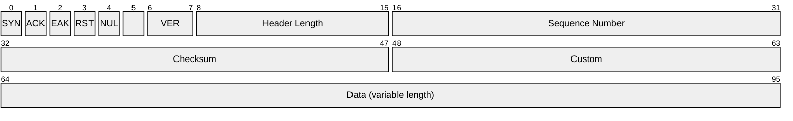

# canal

## Prerequisites

1. stable rust toolchains: `rustup toolchain install stable`
1. nightly rust toolchains: `rustup toolchain install nightly --component rust-src`
1. (if cross-compiling) rustup target: `rustup target add ${ARCH}-unknown-linux-musl`
1. (if cross-compiling) LLVM: (e.g.) `brew install llvm` (on macOS)
1. (if cross-compiling) C toolchain: (e.g.) [`brew install filosottile/musl-cross/musl-cross`](https://github.com/FiloSottile/homebrew-musl-cross) (on macOS)
1. bpf-linker: `cargo install bpf-linker` (`--no-default-features` on macOS)

## Build & Run

Use `cargo build`, `cargo check`, etc. as normal. Run your program with `xtask run`.

Cargo build scripts are used to automatically build the eBPF correctly and include it in the
program. When not using `xtask run`, eBPF code generation is skipped for a faster developer
experience; this compromise necessitates the use of `xtask` to actually build the eBPF.

## Cross-compiling on macOS

Cross compilation should work on both Intel and Apple Silicon Macs.

```shell
AYA_BUILD_EBPF=true CC=${ARCH}-linux-musl-gcc cargo build --package canal --release \
  --target=${ARCH}-unknown-linux-musl \
  --config=target.${ARCH}-unknown-linux-musl.linker=\"${ARCH}-linux-musl-gcc\"
```
The cross-compiled program `target/${ARCH}-unknown-linux-musl/release/canal` can be
copied to a Linux server or VM and run there.

## Design

### RUDP Header

